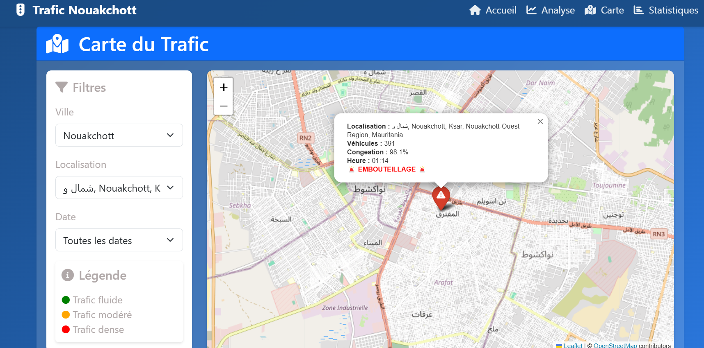
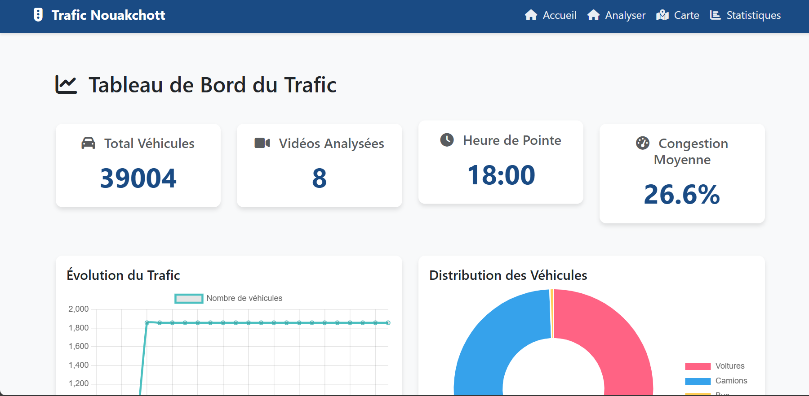

# 📊 Plateforme de suivi du trafic routier en Mauritanie

<p align="center">
  <b>Une plateforme interactive pour analyser l'évolution du trafic routier en Mauritanie, comprendre les dynamiques de circulation et améliorer la gestion des infrastructures.</b>  
</p>

<p align="center">
  🚗 <i>Suivi du trafic</i> | 📈 <i>Visualisation des tendances de circulation</i> | 🏗️ <i>Optimisation des infrastructures</i>  
</p>

---

## 🌍 Table des Matières
🔹 [📖 Description du Projet](#-description-du-projet)  
🔹 [🎯 Objectif](#-objectif)  
🔹 [⚙️ Technologies Utilisées](#%EF%B8%8F-technologies-utilisées)  
🔹 [🚀 Fonctionnalités Clés](#-fonctionnalités-clés)  
🔹 [📸 Aperçu Visuel](#-aperçu-visuel)  
🔹 [📦 Installation & Utilisation](#-installation--utilisation)   
🔹 [📬 Contact](#-contact)  

---

## 📖 Description du Projet  
**Suivi du Trafic Routier en Mauritanie** est un outil interactif conçu pour surveiller et analyser le flux de circulation sur les routes mauritaniennes. Grâce à des cartes dynamiques et des statistiques en temps réel, cette plateforme permet d’optimiser la gestion du trafic et d'améliorer la planification des infrastructures.

- **🚦 Interface intuitive** pour explorer les variations de trafic en fonction des heures et des zones géographiques.
- **📊 Analyse détaillée** des tendances de circulation avec des visualisations interactives.
- **🛣️ Optimisation des infrastructures** en identifiant les points de congestion et en proposant des solutions adaptées.

--- 

## 🎯 Objectif  
Le principal objectif de ce projet est de fournir une plateforme **dynamique** et **précise** pour l’analyse du trafic routier en Mauritanie. En offrant des outils interactifs, ce projet vise à :

- **Faciliter la gestion du trafic** en identifiant les zones les plus congestionnées.
- **Aider à la prise de décision** pour les urbanistes, autorités locales et gestionnaires d'infrastructures.
- **Proposer une plateforme évolutive** intégrant des données en temps réel et des prévisions basées sur l’IA.

🎯 **Pour qui ?**  
- **Urbanistes & planificateurs** 🏗️  
- **Gouvernements & collectivités** 📊  
- **Entreprises de logistique & transport** 🚚  
- **Citoyens et conducteurs** 🚗  

---

## ⚙️ Technologies Utilisées  

| 🛠️ Technologie | 🚀 Rôle |
|----------------|--------|
| 🐍 **Python**   | Backend et traitement des données |
| 🌍 **Django**   | Développement du serveur web |
| 🗄️ **PostgreSQL** | Base de données |
| 🎨 **HTML / CSS / JS** | Conception et développement de l'interface utilisateur |
| 📊 **Leaflet / D3.js** | Cartographie interactive et visualisation des données |
| 🛰️ **API OpenStreetMap** | Collecte et affichage des données géographiques |

---

## 🚀 Fonctionnalités Clés  
✅ **🗺️ Cartographie interactive** – Visualisation en temps réel des flux de circulation.  
✅ **📊 Statistiques détaillées** – Analyse des tendances du trafic selon l'heure et le jour.  
✅ **🚦 Détection des zones de congestion** – Identification des axes à forte densité de véhicules.  
✅ **🔍 Filtres avancés** – Sélection de périodes spécifiques et comparaison des flux de circulation.  
✅ **📡 API RESTful** – Accès aux données pour les intégrateurs et développeurs.  

---

## 📸 Aperçu Visuel  

### Carte des zones de trafic intense :  


### Tableau de bord:  


---

## 📦 Installation & Utilisation  

Suivez ces étapes pour installer et lancer le projet sur votre machine locale :

```bash
# 1️⃣ Cloner le projet depuis GitHub
git clone https://github.com/AmadouMamadouDiallo/Suivi-du-trafic-routier-Mauritanie.git
cd Suivi-du-trafic-routier-Mauritanie

# 2️⃣ Créer un environnement virtuel et installer les dépendances
python -m venv venv
source venv/bin/activate  # (Sous Windows: venv\Scripts\activate)
pip install -r requirements.txt

# 3️⃣ Appliquer les migrations de la base de données
python manage.py migrate

# 4️⃣ Lancer le serveur Django
python manage.py runserver

# 5️⃣ Accéder à l'application via votre navigateur
http://127.0.0.1:8000/
```

---

## 📬 Contact  
Pour toute question, suggestion ou collaboration, n'hésitez pas à me contacter :

📧 Email : 23217@esp.mr  
🔗 LinkedIn : www.linkedin.com/in/amadou-diallo-ing04
